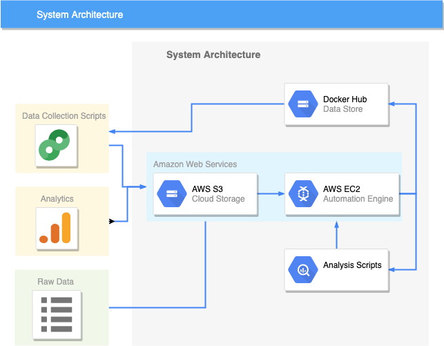

Software Engineering Trends on Docker Hub
=========================================

An end-to-end framework which help the company to predict software engineering trends and the developers to know more about a docker image.

Our goal is to provide different companies with a dynamic dataset through which meaningful inferences can be made.

Under the mentorship of Nandhini from Docker, our aim is to gather data from Docker Hub and analyse the trends. Docker Hub is a cloud-based repository in which Docker users and partners create, test, store and distribute container images.

# Requirements
We use Conda to manage the environment and packages.

We use the following packages (among many others):
- Python 3.6 or above
- Pandas
- Matplotlib
- Plotly
- Seaborn
- boto3

# Installation
#### 1. Downloading this Respository
Start by [downloading](https://github.com/cshubhamrao/docker-hub-data-x/archive/master.zip) or cloning this repository.
```bash
git clone https://github.com/cshubhamrao/docker-hub-data-x.git
cd docker-hub-data-x
```

#### 2. Create and Activate Environment
Create the conda environment from the `environment.yml` file:

```bash
conda env create -f environment.yml
```

Now activate the environment by:

```bash
conda activate docker-hub
```

#### 3. Run Jupyter Lab

```bash
jupyter lab
```

# Contents
1. [Data](data/) - This folder contains all the data related files and folders that are generated or are stored for later use. 
This is also the folder where all the 'plots' generated by [```analytics.ipynb```](scripts/analytics.ipynb) and another scripts.
2. [Misc](misc/) - Contains all the miscellaneous scripts that are required for this project.
3. [Scripts](scripts/) - This folder is the main folder. This contains all the scripts that we used to scrape the data, clean that data, 
select required data to do analysis, and finally do analysis on the data and derive inference from the data.

# Team Members
- Niladri Shekhar Dutt
- Saurabh Ghanekar
- Shubham Rao
- Sejal Mohata
- Tanmay Agarwal

# System Architecture:

